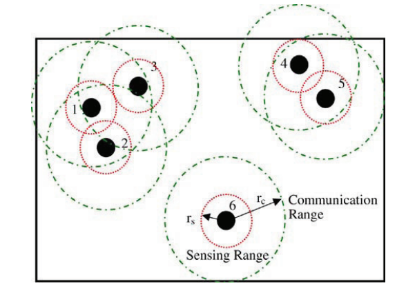

# DMCAE（Distributed Multi-Robot Coordination in Area Exploration）

## 分布式多机器人协同探索
这个项目是依据Sheng W等人于2006年发表的《Distributed multi-robot coordination in area exploration》，文中对二维空间中通信能力有限的机器人如何高效地协同探索的场景进行了深入的研究，提出了一种解决方案，由于篇幅有限，在这里只对总的流程做简单阐述
详细内容请参考论文：

## 场景设定
一个如图1所示的二维空间被分割成50x50个大小相等的方块（它们的大小和智能体正好相同）。在这个空间中随机散布着多个不规则的障碍物（黑色），和多个具有移动、定位、感知、通信能力的智能体（图中为×，程序中为蓝色方块）。假定每一个智能体都知道自己的起始位置，智能体在空间中游走的同时完成对附近区域的探索，当两个智
能体彼此都处在对方的通信范围之内时，它们能够交换地图信息并对信息进行融合；当多个智能体构成一个连通的图时，就形成了连通子网，子网内的智能体之间通过直接或者间接的方式与对方交换地图信息并进行融合。

## 处理流程
在本部分将简要介绍作者在论文中给出的处理流程，并对其中的一些重要的步骤展开描述。
### 总体流程
如图所示，是处理智能体在进行区域探索时所遵循的流程图，虽然不同的算法在细节之处存在差别，但是主要的步骤一致。

首先，给定智能体一个收益函数，智能体根据这个函数寻找自己下一步移动的目标点，使得智能体在此处的收益最大化。然后向子网中的其他智能体广播自己选择的目标点，主持拍卖过程以完成目标点的指派。然后根据路径规划算法导航至目标点，导航过程中不断进行探测和通信，
当其他智能体进入它的通信范围时，二者构成连通关系，相互之间交换信息并将获取到的信息与原有的信息进行融合。重复上述过程，直至探测完整个区域。

### 收益函数
在论文中，作者选用的收益函数为：
$$g_i=\omega_1 I_i-\omega_2 D_i+\omega_3 \lambda_i$$
这里，$\omega_i,i \in \{1,2,3\}$是一个正的权重，而$\lambda_i$表示的是一个衡量智能体之间靠近程度的值（Nearness measure），它的计算方式如下：
$$
\lambda_i = e^{-\frac{d_1}{r_c}} + \alpha e^{-\frac{d_2}{r_c}}+\cdots+\alpha^{n_k-2}e^{-\frac{d_{n_k}-1}{r_c}}
$$
其中，$d_1,d_2,\cdots,d_{n_k-1}$是一个递增序排列的与其他智能体之间的距离。其余的参数含义如下：

| 符号 | 含义 |
|-----|------|
|$I_i$|目标点附近未知区域的面积占比|
|$D_i$|当前位置到达目标点的最短距离|
|$r_c$|智能体的通信覆盖范围|
|$\alpha$|衰减因子（<1）|

### 竞标
智能体在获得边界上所有单元格的收益值后，选出最大的收益值$B=\max g_i$，作为自己的投标值。随后，智能体将自己的投标值向同一子网内的其他智能体进行广播拍卖，在一定时间内如果没有其他智能参与拍卖或者没有其他智能体给出更为好的竞标值，则该智能体竞标成功，即它获得探索该目标点的权利。如果有其他智能体给出更为理想的竞标值，则智能体将任务转移到竞标成功者手中。

### 导航
当智能体的目标点确定之后，需要进行路径规划。该论文中采用的是A*启发式算法算法，它通过一个启发式函数来指导从当前位置到目标点的路径搜索过程，在本程序中所采用的启发函数是
$$f(n)=g(n)+h(n)$$
其中，$g(n)$表示的是从起始位置到当前位置走过的路程，$h(n)$表示的是从当前位置到目标点的估计路程（本程序中采用的是$x,y$轴上对应坐标差的和。）

### 通信与地图融合
在该场景中，由于智能体之间的通信覆盖范围有限，所以多个智能体可能会形成多个连通子图或者孤立节点（如下图所示）。如果孤立节点过多，会导致智能体之间的协同能力降低，从而影响探索效率。所以本文中采用了收益函数部分提到的“Nearness measure”，将它作为收益函数衡量的一部分，是为了尽可能做到通信范围和分散程度上的平衡。

在同一子网下，智能体之间通过直接或者间接的方式共享信息并进行地图融合。因此，在不考虑延迟的情况下，同一子网内的智能体应该是具有相同的局部地图。在此，经过多次迭代后，智能体最终会形成一个全局的地图。
> 论文中，作者还进一步考虑了通信时的数据传输问题，为了避免数据传输量过大，作者设计了一个方法，只传输变动的数据（即新探索的地图信息），从而达到了减少数据传输量的目的。（详见论文）

### 接下来的工作
在这次的工作中，我们复现了论文中的目标点选择、任务指派、导航、区域探索、通信、地图融合等模块，模拟了一个多智能体之间通过彼此通信进行相互协同的过程。目前还存在的缺陷是对于论文中作者提出的减少
通信量的方法并没有实现，接下来的工作是在实现该方法的基础之上，进一步结合Delong Zhu等人在《Deep Reinforcement Learning Supervised Autonomous Exploration in Office Environments》提出的针对特定
环境（office）利用强化学习训练得到该类环境的模式，并将这种模式作为先验知识，用来辅助目标点选择。

## 效果演示
[演示视频](https://www.bilibili.com/video/av59200998?pop_share=1)

## Reference：
Sheng W, Yang Q, Tan J, et al. Distributed multi-robot coordination in area exploration[J]. Robotics and Autonomous Systems, 2006, 54(12): 945-955.

